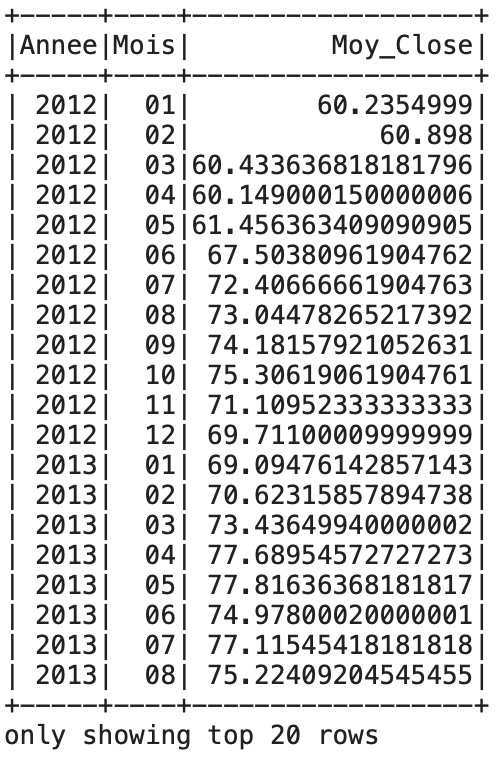

# TP_WALMART
Ce TP a été commencé en classe, seule la dernière question manquait.

# Exécution du programme à partir d'un terminal
  Ouvrir un terminal et taper les lignes suivantes :
 - git clone https://github.com/NolanCarre/TP_WALMART.git 
 - cd TP_WALMART
 - jupyter nbconvert --to python Script/TP_WALMART.ipynb
 - python Script/TP_WALMART.py 
 
 # Question 12 
 Voici la moyenne de Close pour chaque mois de chaque annee : 
 
 
